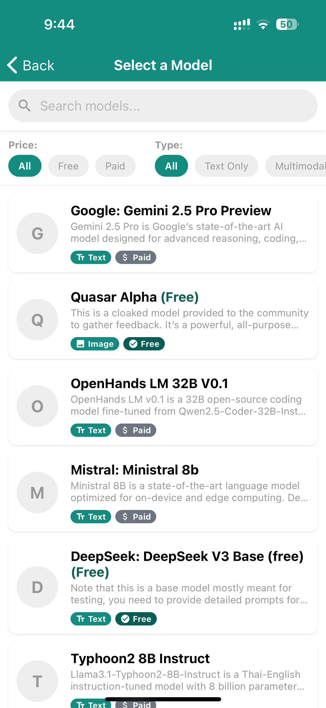

# OpenRouterChat

<div align="center">
  
  <p>A WhatsApp-style chat application for conversing with various AI models through the OpenRouter API.</p>
</div>

## 🌟 Features

- **Multiple AI Models**: Access 100+ AI models from OpenAI, Anthropic, Google, Meta and more
- **Familiar Interface**: WhatsApp-inspired UI for a seamless messaging experience
- **API Key Management**: Settings page to securely manage your OpenRouter API key
- **Chat Management**: Create and maintain multiple conversations with different AI models
- **Model Selection**: Browse and select from a variety of AI models with detailed information
- **Persistent History**: Chat history saved locally to your device
- **Responsive Design**: Works on both iOS and Android devices

## 📱 Screenshots

<div align="center">
  <table>
    <tr>
	<td></td>  
	<td></td>
	<td></td>
	<td></td>
    </tr>
  </table>
</div>

## 👨‍💻 Contributors

<div align="center">
  <a href="https://github.com/Ajinkya-Sonawane/openrouter-chat/graphs/contributors">
    
  </a>
</div>

<div align="center">
  <p>
    <a href="https://github.com/Ajinkya-Sonawane/openrouter-chat/graphs/contributors">
      View all contributors
    </a>
  </p>
  <p>
    <i>Want to be a contributor? See our <a href="#🤝-contributing">contribution guidelines</a>!</i>
  </p>
</div>

## 🚀 Getting Started

### Prerequisites

- [Node.js](https://nodejs.org/) (v16+)
- [npm](https://www.npmjs.com/) or [Yarn](https://yarnpkg.com/)
- [Expo CLI](https://docs.expo.dev/workflow/expo-cli/)
- [OpenRouter](https://openrouter.ai/) account (for API key)

### Installation

1. Clone this repository

```bash
git clone https://github.com/Ajinkya-Sonawane/openrouter-chat.git
cd openrouter-chat
```

2. Install dependencies

```bash
npm install
# or
yarn install
```

3. Start the Expo development server

```bash
npx expo start
```

4. Scan the QR code with the Expo Go app on your mobile device

### API Key Setup

To use this app, you'll need an OpenRouter API key:

1. Create an account on [OpenRouter](https://openrouter.ai)
2. Generate an API key at [openrouter.ai/keys](https://openrouter.ai/keys)
3. In the app, tap the settings icon in the top right corner
4. Enter your API key in the settings page and tap "Save"

### Environment Configuration (Optional)

For development purposes, you can configure environment variables:

1. Copy `.env.example` to `.env` in the project root
2. Replace the placeholder values with your actual configuration
3. Restart the development server

All URLs in the app are stored in a central configuration file (`src/constants/index.ts`), making it easy to update them as needed.

## 🚀 Technology Stack

- **Framework**: [React Native](https://reactnative.dev/) with [Expo](https://expo.dev/)
- **Language**: [TypeScript](https://www.typescriptlang.org/)
- **Navigation**: [React Navigation](https://reactnavigation.org/)
- **State Management**: React Hooks and Context API
- **Storage**: [AsyncStorage](https://react-native-async-storage.github.io/async-storage/)
- **UI Components**: Custom components styled with React Native StyleSheet
- **API Integration**: [Axios](https://axios-http.com/) for OpenRouter API requests

## 📋 Available Models

OpenRouter provides access to models from various providers:

- **OpenAI**: GPT-4o, GPT-4, GPT-3.5-Turbo
- **Anthropic**: Claude 3 Opus, Claude 3 Sonnet, Claude 3 Haiku
- **Google**: Gemini 1.5 Pro, Gemini 1.0 Pro
- **Meta**: Llama 3 (various sizes)
- **Mistral AI**: Mistral Large, Mistral Medium, Mistral Small
- And many more...

The availability of models depends on your OpenRouter subscription and credits.

## 🤝 Contributing

We welcome contributions to OpenRouter Chat! Here's how you can help:

1. **Fork the Repository**: Create your own fork of the project
2. **Create a Feature Branch**: `git checkout -b feature/amazing-feature`
3. **Make Your Changes**: Implement your feature or bug fix
4. **Commit Your Changes**: `git commit -m 'Add some amazing feature'`
5. **Push to Your Branch**: `git push origin feature/amazing-feature`
6. **Open a Pull Request**: Submit your changes for review

### Contribution Guidelines

- Follow the existing code style and conventions
- Write clean, maintainable, and testable code
- Update documentation to reflect any changes
- Add comments to explain complex logic
- Test your changes thoroughly before submitting a PR

### Development Process

1. Check the [Issues](https://github.com/Ajinkya-Sonawane/openrouter-chat/issues) for tasks to work on
2. Comment on an issue to express your interest before starting work
3. Reference the issue number in your commit messages
4. Create a detailed PR description explaining your changes and the problem they solve

## 🐛 Troubleshooting

- **API Key Issues**: If you encounter "API key required" errors, check your OpenRouter API key in the Settings.
- **Model Unavailability**: Some models may require additional credits or be unavailable depending on your OpenRouter plan.
- **Rate Limiting**: If you see rate limit errors, wait a few minutes before trying again.
- **Connection Issues**: Ensure you have a stable internet connection for reliable model responses.
- **App Performance**: If the app becomes slow, try clearing your chat history in Settings.

## 📜 License

This project is licensed under the MIT License - see the [LICENSE](LICENSE) file for details.

## 🙏 Acknowledgements

- [OpenRouter](https://openrouter.ai/) for providing access to multiple AI models
- [React Native](https://reactnative.dev/) and [Expo](https://expo.dev/) communities
- All [contributors](https://github.com/Ajinkya-Sonawane/openrouter-chat/contributors) who have helped improve this project

---

<div align="center">
  <p>If you find this project useful, please consider giving it a ⭐️ on GitHub!</p>
  <p>Made with ❤️ by the OpenRouter Chat team</p>
</div>
